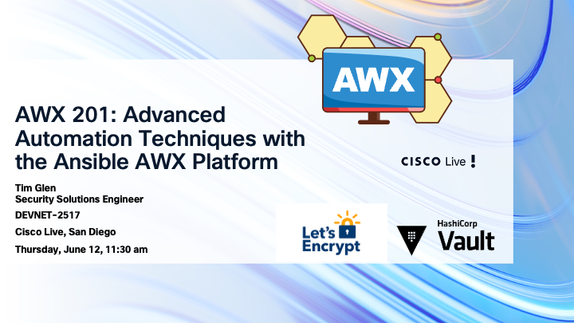

# 2025 Cisco Live Amsterdam GO BEYOND

Welcome to the repository for “AWX 201: Advanced Automation Techniques with the Ansible AWX Platform and GitHub Copilot” presented at Cisco Live Amsterdam 2025!

This session (Code: DEVNET-2517) is designed to help you dive deeper into AWX.
During this session, we’ll cover the we will learn some advanced AWX topics like:

	•	Execution Environments: Why the built in one may not be enough, why and how to build new. 
	•   Integration with HashiCorp Vault: Storing your secrets the right way.
	•	Custom Credential Types: When the default types conflict and you need more.
	•	GitHub CoPilot: ah, wow! You need to be using this! 

This repository contains the resources, examples, and playbooks used during the session. Feel free to clone or fork the repository to follow along during the presentation or revisit the materials afterward. Whether you’re just starting your automation journey or looking to enhance your skills, this session provides the foundational knowledge needed to leverage AWX effectively in your environment.

Let’s automate together! 🚀

Thanks to ChatGPT for helping with this README file! Tim

